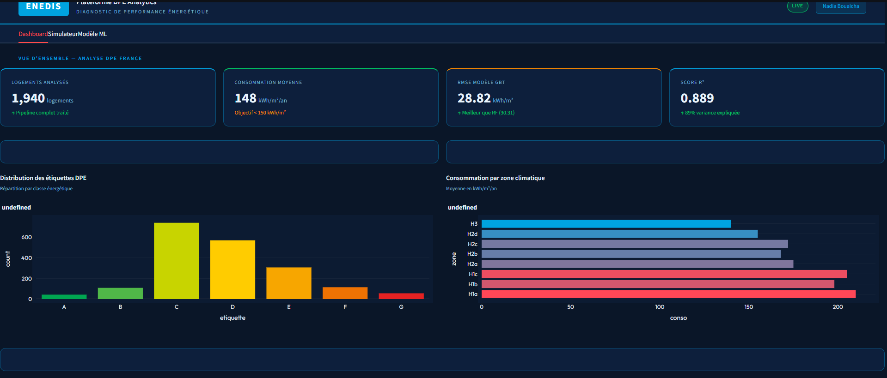
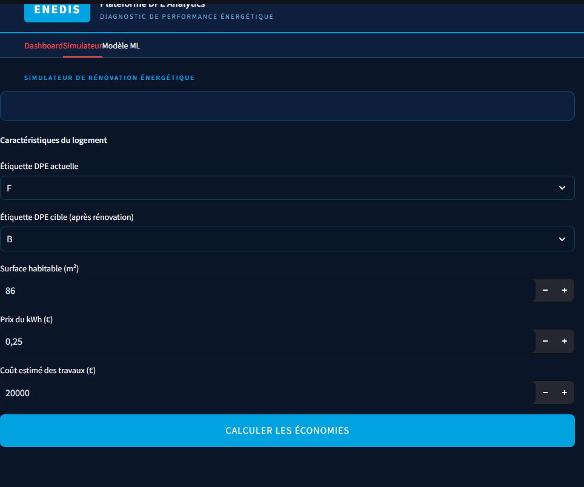
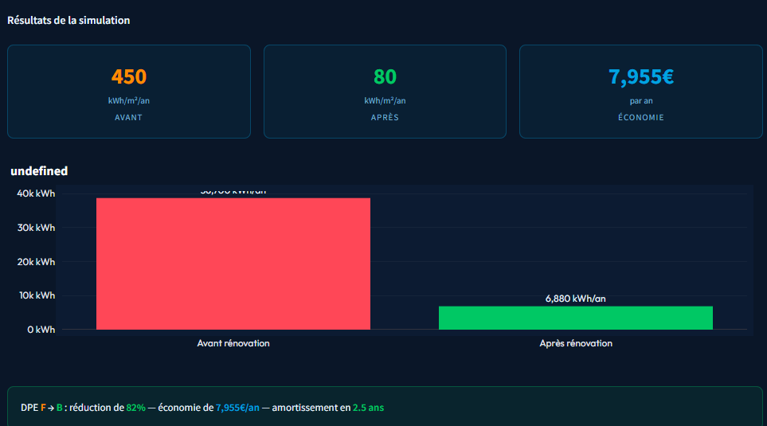
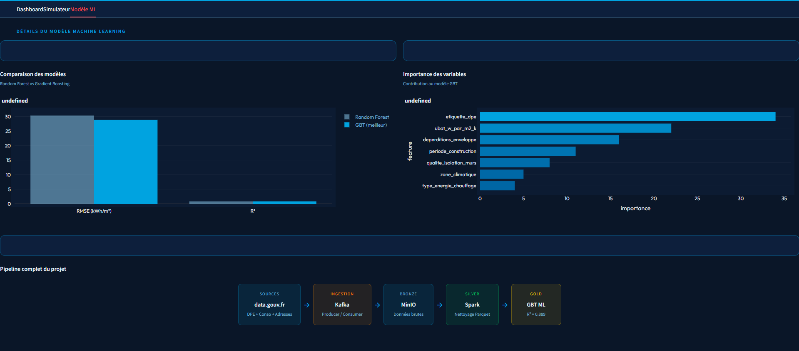

# Retrofit-ML — Pipeline DPE & Prédiction de Consommation Électrique

## Description du projet

Ce projet s'inscrit dans le cadre du challenge
[Diagnostics de Performance Énergétique](https://defis.data.gouv.fr/defis/diagnostics-de-performance-energetique)
proposé par **Enedis**.

Le projet est divisé en deux parties complémentaires :

**Partie Data Analyse** — Analyse de l'impact des classes DPE (A→G) sur les
consommations électriques réellement mesurées. Quantification du gain en kWh/an
induit par une amélioration de classe DPE (passage de F→E, E→D, etc.)

**Partie Data Science** — Construction d'un outil de prédiction des économies
suite à une rénovation énergétique. Prédiction de la consommation électrique
des foyers français en fonction du DPE, de l'adresse et des caractéristiques
démographiques disponibles.

---

## Sources des données

| Dataset                               | Producteur                                                         | Licence             | Description                            |
| ------------------------------------- | ------------------------------------------------------------------ | ------------------- | -------------------------------------- |
| DPE v2 — Logements existants          | [ADEME](https://data.ademe.fr/datasets/dpe-v2-logements-existants) | Licence Ouverte 2.0 | Diagnostics de Performance Énergétique |
| Consommation électrique résidentielle | [data.gouv.fr](https://www.data.gouv.fr)                           | Licence Ouverte 2.0 | Consommation annuelle par adresse      |
| Base Adresse Nationale                | [adresse.data.gouv.fr](https://adresse.data.gouv.fr)               | Licence Ouverte 2.0 | Référentiel national des adresses      |

---

## Architecture complète du pipeline

```
Sources de données
(ADEME API + data.gouv.fr)
          │
          ▼
┌─────────────────────────────────────┐
│           Apache Kafka              │
│  producer.py     (topic: open-data) │
│  producer_dpe.py (topic: dpe-data)  │
│  addresses_producer.py              │
└─────────────────┬───────────────────┘
                  │
                  ▼
┌─────────────────────────────────────┐
│          Kafka Consumers            │
│  consumer.py    → bronze/dpe_*.json │
│  dpe_consumer.py                    │
└─────────────────┬───────────────────┘
                  │
                  ▼
┌─────────────────────────────────────────────┐
│              MinIO (Data Lake)              │
│                                             │
│  datalake/                                  │
│  ├── bronze/   ← données brutes             │
│  │   ├── date=YYYY-MM-DD/                   │
│  │   │   └── dpe_*.json  (NDJSON)           │
│  │   ├── dpe_batch_*.json                   │
│  │   └── consommation-annuelle-*.json       │
│  │                                          │
│  ├── silver/   ← données nettoyées Parquet  │
│  │   ├── addresses/                         │
│  │   ├── dpe/                               │
│  │   └── consommation/                      │
│  │                                          │
│  └── gold/     ← résultats ML               │
│      ├── predictions/                       │
│      ├── metrics/                           │
│      └── model/                             │
└─────────────────┬───────────────────────────┘
                  │
        ┌─────────┴──────────┐
        ▼                    ▼
┌──────────────┐    ┌─────────────────┐
│     EDA      │    │   Machine       │
│  Analyse     │    │   Learning      │
│  impact DPE  │    │   RF + GBT      │
│  A→G         │    │   R²=0.889      │
└──────────────┘    └────────┬────────┘
                             │
                             ▼
                   ┌──────────────────┐
                   │    Streamlit     │
                   │    Dashboard     │
                   │  + Simulateur    │
                   └──────────────────┘
                             │
                             ▼
                   ┌──────────────────┐
                   │  Apache Airflow  │
                   │  Orchestration   │
                   └──────────────────┘
```

---

## Stack technique

| Outil              | Version | Rôle                                    |
| ------------------ | ------- | --------------------------------------- |
| **Apache Kafka**   | 4.2.0   | Streaming et ingestion des données      |
| **MinIO**          | latest  | Data Lake local compatible S3           |
| **Apache Spark**   | 4.0.2   | Traitement distribué des données        |
| **Spark MLlib**    | 4.0.2   | Machine Learning distribué              |
| **Apache Airflow** | 2.8.1   | Orchestration du pipeline               |
| **Streamlit**      | 1.32.0  | Dashboard et déploiement du modèle      |
| **Docker**         | latest  | Containerisation de tous les services   |
| **Python**         | 3.10    | Scripts producteur/consommateur/analyse |

---

## Structure du projet

```
Retrofit-ML/
│
├── producer/
│   ├── producer.py                  # Producer principal (ADEME API)
│   ├── producer_dpe.py              # Producer DPE
│   ├── addresses_producer.py        # Producer Addresses (CSV BAN)
│   └── requirements.txt
│
├── consumer/
│   ├── consumer.py                  # Consumer principal → MinIO bronze
│   ├── dpe_consumer.py              # Consumer DPE → MinIO bronze
│   ├── verify_bronze.py             # Vérification couche bronze
│   └── requirements.txt
│
├── processing/
│   ├── clean_all.py                 # Bronze → Silver (nettoyage Spark)
│   ├── fix_consommation.py          # Correction structure JSON consommation
│   ├── fix_dpe.py                   # Correction structure JSON DPE
│   ├── gold_ml.py                   # Silver → Gold (ML Random Forest + GBT)
│   ├── silver_transform.py          # Transformation Silver
│   ├── gold_analysis.py             # Analyse Gold
│   ├── extract_dpe_sample.py        # Extraction échantillon DPE
│   └── requirements.txt
│
├── eda/
│   └── DPE Analysis.ipynb           # Analyse exploratoire impact DPE A→G
│
├── dashboard/
│   ├── app.py                       # Dashboard Streamlit Enedis + Simulateur
│   ├── dashboard.py                 # Dashboard analyse EDA
│   └── requirements.txt
│
├── airflow/
│   ├── dags/
│   │   └── dpe_pipeline_dag.py      # DAG Airflow pipeline complet
│   └── docker-compose.yml           # Airflow via Docker
│
├── infra/
│   ├── create_topic.py              # Création topics Kafka
│   └── docker-compose.yml           # Infrastructure Kafka + MinIO
│
├── assets/
│   ├── 1a.png                       # Dashboard vue d'ensemble
│   ├── 2a.png                       # Graphiques d'analyse
│   ├── 3a.png                       # Simulateur rénovation
│   └── 4a.png                       # Résultats simulation
│
├── .gitignore
└── README.md
```

---

## Instructions d'installation et d'exécution

### Prérequis

- Docker & Docker Compose installés
- Python 3.9+
- Git
- JARs Hadoop dans un dossier `jars/` (non versionné) :
  - `hadoop-aws-3.3.4.jar`
  - `aws-java-sdk-bundle-1.12.262.jar`

### Étape 1 — Lancer l'infrastructure

```bash
cd infra/
docker compose up -d
docker compose ps
```

**Services lancés :**

| Service       | URL                   | Utilité             |
| ------------- | --------------------- | ------------------- |
| Kafka         | `localhost:9092`      | Broker de messages  |
| Kafka UI      | http://localhost:8080 | Interface web Kafka |
| MinIO API     | `localhost:9000`      | API S3-compatible   |
| MinIO Console | http://localhost:9001 | Interface web MinIO |

**Credentials MinIO :** `minioadmin` / `minioadmin`

### Étape 2 — Créer les topics Kafka

```bash
cd infra/
pip install kafka-python
python create_topic.py
```

### Étape 3 — Lancer les Consumers en premier

```bash
cd consumer/
pip install -r requirements.txt

# Consumer principal
python consumer.py

# Options avancées
python consumer.py --batch-size 200 --flush-interval 20

# Consumer DPE
python dpe_consumer.py
```

### Étape 4 — Lancer les Producers

```bash
cd producer/
pip install -r requirements.txt

# Test avec 1000 lignes
python producer.py --limit 1000

# Production complète
python producer.py

# Producer DPE
python producer_dpe.py

# Producer Addresses
python addresses_producer.py
```

### Étape 5 — Vérifier la couche Bronze

```bash
cd consumer/
python verify_bronze.py
```

Visuellement : **http://localhost:9001** → Bucket `datalake` → Dossier `bronze/`

### Étape 6 — Nettoyage Silver (Spark)

```bash
docker run -it \
  -v "/chemin/vers/processing:/scripts" \
  -v "/chemin/vers/jars:/jars" \
  -e HOME=/root --user root apache/spark:4.0.2 \
  /bin/bash -c "pip install numpy --quiet && \
  /opt/spark/bin/spark-submit \
  --jars /jars/aws-java-sdk-bundle-1.12.262.jar,/jars/hadoop-aws-3.3.4.jar \
  /scripts/clean_all.py"
```

### Étape 7 — Machine Learning Gold (Spark)

```bash
docker run -it \
  -v "/chemin/vers/processing:/scripts" \
  -v "/chemin/vers/jars:/jars" \
  -e HOME=/root --user root apache/spark:4.0.2 \
  /bin/bash -c "pip install numpy --quiet && \
  /opt/spark/bin/spark-submit \
  --jars /jars/aws-java-sdk-bundle-1.12.262.jar,/jars/hadoop-aws-3.3.4.jar \
  /scripts/gold_ml.py"
```

### Étape 8 — Orchestration Airflow

```bash
cd airflow/
docker-compose up airflow-init
docker-compose up -d
```

Ouvre **http://localhost:8080** (admin / admin) et déclenche le DAG `dpe_pipeline`.

### Étape 9 — Dashboard Streamlit

```bash
cd dashboard/
pip install -r requirements.txt
python -m streamlit run app.py
```

Ouvre **http://localhost:8501**

### Arrêter l'infrastructure

```bash
cd infra/
docker compose down       # arrêter sans supprimer les données
docker compose down -v    # arrêter ET supprimer les données MinIO
```

---

## Format d'un message DPE dans Kafka

```json
{
  "N°DPE": "2193E0971280J",
  "Date_réception_DPE": "2021-07-01",
  "Etiquette_DPE": "D",
  "Etiquette_GES": "D",
  "Conso_5_usages_é_finale": 152.3,
  "Emission_GES_5_usages_par_m²": 22.1,
  "Surface_habitable_logement": 75.0,
  "Type_bâtiment": "Appartement",
  "_pipeline_source": "ademe-dpe-v2",
  "_pipeline_timestamp": "2024-01-15T14:30:21Z"
}
```

---

## Partie Data Analyse — Analyse impact classes DPE

### Objectif

Analyser l'impact réel des classes DPE sur la consommation électrique mesurée
et quantifier les gains en kWh/an pour chaque amélioration de classe DPE.

### Notebook

`eda/DPE Analysis.ipynb` — Analyse exploratoire complète

---

## Partie Data Science — Prédiction de consommation

### Objectif (DSO)

Prédire la consommation électrique en kWh/m²/an d'un logement français
à partir de ses caractéristiques DPE pour quantifier les économies
potentielles d'une rénovation énergétique.

### Variables explicatives

| Variable                            | Type         | Description                          |
| ----------------------------------- | ------------ | ------------------------------------ |
| `etiquette_dpe`                     | Catégorielle | Étiquette DPE (A à G)                |
| `type_batiment`                     | Catégorielle | Maison / Appartement / Immeuble      |
| `periode_construction`              | Catégorielle | Époque de construction               |
| `zone_climatique`                   | Catégorielle | Zone H1 / H2 / H3                    |
| `qualite_isolation_*`               | Catégorielle | Qualité isolation (5 variables)      |
| `type_energie_principale_chauffage` | Catégorielle | Gaz / Électricité / etc.             |
| `ubat_w_par_m2_k`                   | Numérique    | Coefficient de déperdition thermique |
| `deperditions_enveloppe`            | Numérique    | Déperditions thermiques totales      |
| `surface_habitable_immeuble`        | Numérique    | Surface en m²                        |
| `conso_moyenne_commune_mwh`         | Numérique    | Consommation moyenne de la commune   |

### Résultats des modèles

| Modèle                    | RMSE (kWh/m²) | R²         |
| ------------------------- | ------------- | ---------- |
| Random Forest (50 arbres) | 30.31         | 0.8768     |
| **GBT Gradient Boosting** | **28.82**     | **0.8886** |

**Meilleur modèle : GBT avec R² = 0.889**

Le modèle explique **89% de la variabilité** de la consommation électrique.
L'erreur moyenne de **28.82 kWh/m²** représente ~15% d'erreur relative.

### Importance des variables

| Rang | Variable                 | Importance |
| ---- | ------------------------ | ---------- |
| 1    | `etiquette_dpe`          | 34%        |
| 2    | `ubat_w_par_m2_k`        | 22%        |
| 3    | `deperditions_enveloppe` | 16%        |
| 4    | `periode_construction`   | 11%        |
| 5    | `qualite_isolation_murs` | 8%         |
| 6    | `zone_climatique`        | 5%         |
| 7    | `type_energie_chauffage` | 4%         |

---

## Aperçu du dashboard

### Dashboard principal



### Graphiques d'analyse



### Simulateur de rénovation



### Résultats simulation



---
